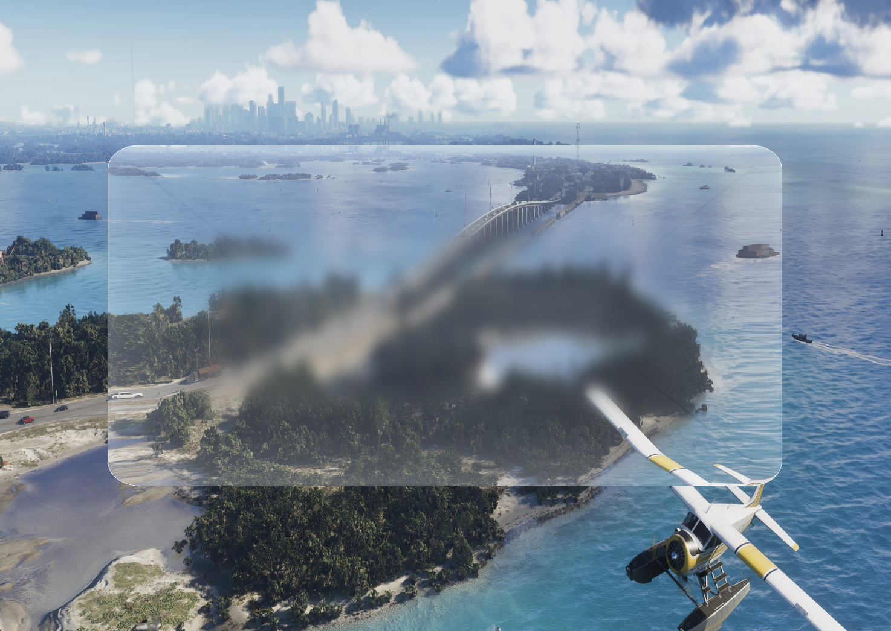

# Metal Rendering Playground

A macOS/iOS/tvOS learning project built on top of Apple's *"Using Metal to Draw a View's Contents"* sample. The original sample draws a colored background; this repo extends it step by step into a liquid-glass compositor with a two-pass Gaussian blur.



## What it renders

| Layer        | File                   | Description                                                                                                                |
| ------------ | ---------------------- | -------------------------------------------------------------------------------------------------------------------------- |
| Background   | `Background.metal`   | Full-screen textured quad — displays an image loaded at runtime                                                           |
| Liquid glass | `LiquidGlass.metal`  | SDF rounded rectangle with convex lens normals, refraction, Fresnel, rim highlight, and frosted interior                   |
| Frosting     | `GaussianBlur.metal` | Two-pass separable Gaussian blur (horizontal → vertical) baked into an off-screen texture and sampled by the glass shader |

The triangle (`Triangle.metal`) from the original Apple sample is still present as a reference.

## Project layout

```
.
├── Application/
│   ├── AAPLViewController.mm   # MTKView setup; macOS "Background" menu bar item
│   └── AAPLAppDelegate.mm
├── Renderer/
│   ├── AAPLRenderer.mm         # Command encoding: blur passes → background → glass
│   ├── AAPLShaderTypes.h       # Shared C/Metal structs and buffer/texture index enums
│   ├── Background.metal        # backgroundVertex / backgroundFragment
│   ├── GaussianBlur.metal      # blurVertex / gaussianBlurFragment
│   ├── LiquidGlass.metal       # glassVertex / glassFragment
│   └── Triangle.metal          # vertexShader / fragmentShader (original sample)
├── Guides/
│   ├── triangle.md             # How to draw a colored triangle
│   ├── background.md           # How to load an image and display it as background
│   ├── Liquid_Glass.md         # How the liquid glass effect works end-to-end
│   ├── Blur.md                 # Two-pass Gaussian blur implementation guide
│   └── API.md                  # Metal API quick reference
└── MetalKitAndRenderingSetup.xcodeproj
```

## Features

- **Liquid glass effect** — SDF-based rounded rectangle, convex lens height field, finite-difference surface normals, `refract()` UV distortion, Schlick Fresnel, rim highlight, edge glow, centre caustic.
- **Two-pass Gaussian blur** — separable H+V passes into `MTLStorageModePrivate` off-screen textures. Re-blurs only when the background image changes (`_blurDirty` flag), not every frame. Default σ = 20 (Dock-like frosting).
- **Runtime background loading** — macOS menu bar item (`Background › Add Background…`) opens an `NSOpenPanel`; the chosen image is uploaded via `MTKTextureLoader` and immediately composited under the glass.
- **Cross-platform** — builds for macOS, iOS, and tvOS simulator (conditional compilation via `TARGET_OS_OSX` / `TARGET_OS_IOS`).
- **Objective-C++** — all `.mm` files mix Objective-C Metal APIs with C++ where convenient.

## Building

Open `MetalKitAndRenderingSetup.xcodeproj` in Xcode 15+ and build the scheme for your target (Mac, iPhone Simulator, or Apple TV Simulator). No external dependencies.

## Guides

The `Guides/` directory contains step-by-step tutorials written for developers with an OpenGL/Vulkan background:

- [triangle.md](Guides/triangle.md) — vertex buffers, pipeline state objects, and the Metal draw loop.
- [background.md](Guides/background.md) — `MTKTextureLoader`, samplers, textured quads, and `NSOpenPanel`.
- [Liquid_Glass.md](Guides/Liquid_Glass.md) — SDFs, height fields, normals, refraction, Fresnel, and alpha blending.
- [Blur.md](Guides/Blur.md) — separable Gaussian blur, off-screen render targets, and the `_blurDirty` pattern.

## Tuning the glass

All visual parameters live in `LiquidGlass.metal` and `AAPLRenderer.mm`:

| Parameter            | Location              | Default                       | Effect                                        |
| -------------------- | --------------------- | ----------------------------- | --------------------------------------------- |
| `boxHalf`          | `LiquidGlass.metal` | `(0.65, 0.42)`              | Glass panel size in aspect-corrected units    |
| `cornerR`          | `LiquidGlass.metal` | `0.06`                      | Corner radius (smaller = sharper rect)        |
| `refractStr`       | `LiquidGlass.metal` | `0.03`                      | Strength of edge refraction distortion        |
| `frostBlend` range | `LiquidGlass.metal` | `smoothstep(0.35, 0.70, t)` | Where frosting fades in from the edge         |
| `_blurSigma`       | `AAPLRenderer.mm`   | `20.0`                      | Gaussian σ in pixels (higher = more frosted) |
